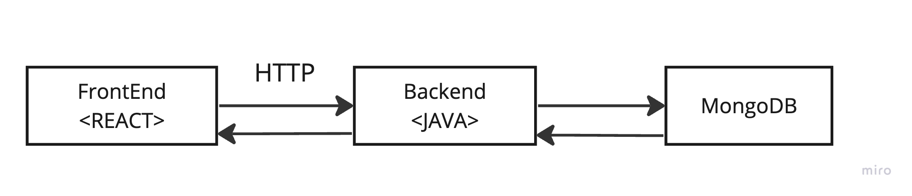
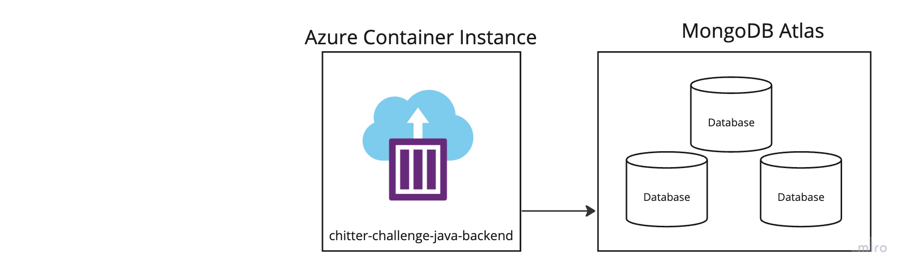
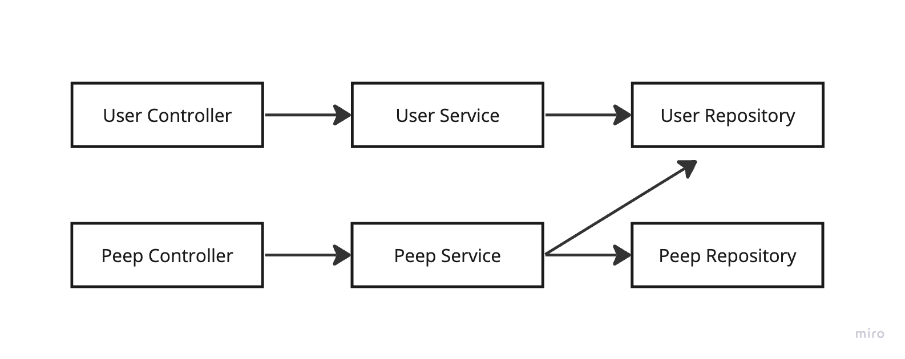

# Chitter Backend recreated using Java and Spring
___

The Chitter Challenge involved creating a full-stack web application that functions like Twitter/X.

Requirements included:
* You should be able to see a list of tweets/peeps on the home page.
* You should be able to register as a new user.
* You should be able to log in and post a tweet/peep.

Here is a link to my original Chitter Challenge project which used the MERN stack (MongoDB, Express, React, Node JS).

https://github.com/BaljitPadda/ChitterChallengePublic

In this Chitter Backend Spring repo, I recreate the Chitter challenge backend using Java and Spring. I have unit tested
both of my services and I have also written integration tests to test my application as a whole.

# Technologies used in this project:

* Java 17
* Spring Boot 3.1.5
* Spring Web & REST
* Spring Data MongoDB
* Spring validation
* Maven
* JUnit
* Mockito

Client server architecture 

Local deployment

Cloud deployment

Backend Application Architecture - Java, Spring Boot

# Final Thoughts
I also wanted to containerise my application and migrate it to the cloud. 
I have containerised my backend using Docker and Docker Maven plugin.
I have also deployed an Azure Container Instance and created a DB in MongoDB Atlas.

# Useful Links:

Deployed Azure Container Instance
https://portal.azure.com/#@baljitpaddahotmailco.onmicrosoft.com/resource/subscriptions/833d00f2-9481-4775-9ed7-80dc6f38966b/resourcegroups/chitter-resource-group/providers/Microsoft.ContainerInstance/containerGroups/chitter-challenge-java/overview

MongoDB Atlas
https://cloud.mongodb.com/v2/656758c845f4d877ac2e91fa#/clusters

Chitter java backend pushed to Docker Hub
https://hub.docker.com/r/baljitpadda/chitter-challenge-java

Get allPeeps API coming from Azure and Atlas
http://20.162.177.206:8080/peeps

